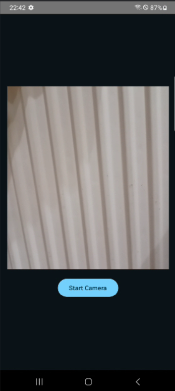

# Odometry Data Recorder

Odometry Data Recorder is a simple Android app designed for recording visual and IMU (Inertial Measurement Unit) data, which can be used for odometry algorithms.

## Features

<p align="center">
  
</p>


- [x] Camera Preview
- [ ] Record visual data using the device's camera.
- [x] Record IMU data including accelerometer and gyroscope readings.
- [x] Save IMU recorded data to files.
- [ ] Save Image recorded data to files.

## Getting Started

### Prerequisites

- Android Studio
- Android device with camera and IMU sensors

### Installation

1. Clone the repository:
    ```sh
    git clone https://github.com/stepeos/OdometryDataRecorder.git
    ```
2. Open the project in Android Studio.
3. Build and run the app on your Android device.

## Usage

1. Launch the app on your Android device.
2. Grant the necessary permissions for camera and sensor access.
3. Start recording visual and IMU data by pressing the appropriate buttons in the app.
4. Save the recorded data for later use in SLAM algorithms.

## Contributing

Contributions are *very much* welcome. Please help.

## License

This project is licensed under the Apache License Version 2.0 - see the [LICENSE](LICENSE) file for details.
